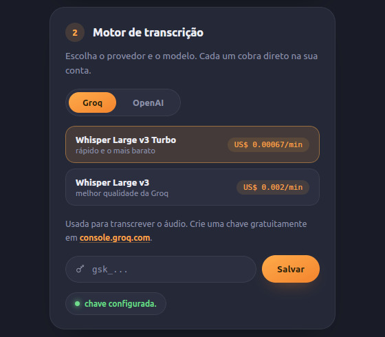
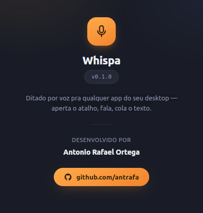

# Whispa

**Dite. Cole. Pronto.**

Whispa é um app de desktop que transcreve sua voz em texto em qualquer aplicativo, com um atalho de teclado. Sem trocar de janela, sem copiar e colar de outro lugar — aperta o atalho, fala, e o texto já está na área de transferência.

<p align="center">
  
</p>

---

## Por que o Whispa

Ferramentas de ditado já existem — mas quase todas são Mac/Windows only, fecham o código, ou empurram você pra um único provedor de IA com preço fixo. O Whispa nasceu porque nenhuma delas funcionava direito no Ubuntu com GNOME.

- **Nativo no Linux** — feito e testado primeiro pra Ubuntu/GNOME, onde a maioria das alternativas simplesmente não roda.
- **Sem vendor lock-in** — escolha o provedor de transcrição (Groq ou OpenAI) e o modelo, com o preço por minuto de cada um visível na hora de decidir.
- **Sua chave, seus dados** — o app nunca vê seu áudio nem sua chave de API. Tudo vai direto do seu computador pro provedor que você escolheu.
- **Feedback visual de verdade** — um indicador flutuante mostra quando está gravando, transcrevendo, ou se algo deu errado, então você nunca cola texto velho por engano.
- **Leve** — construído com Tauri (Rust + WebView nativo), não Electron. Sem Chromium embutido consumindo sua RAM.

## Como funciona

1. Aperta o atalho configurado (`Super+T` por padrão).
2. Fala.
3. Aperta de novo pra parar.
4. O áudio é transcrito pelo provedor escolhido e o texto cai direto na área de transferência — `Ctrl+V` em qualquer app.

<p align="center">
  
</p>

## Escolha seu motor de transcrição

| Provedor | Modelo | Custo aproximado |
|---|---|---|
| Groq | Whisper Large v3 Turbo | US$ 0,0007/min — o mais barato |
| Groq | Whisper Large v3 | US$ 0,002/min — melhor qualidade |
| OpenAI | GPT-4o Mini Transcribe | US$ 0,003/min |
| OpenAI | Whisper-1 | US$ 0,006/min |
| OpenAI | GPT-4o Transcribe | US$ 0,006/min |

Preços cobrados diretamente pelo provedor, na sua própria conta — o Whispa não intermedia, não cobra por uso e não vê seu áudio. Você cria uma chave gratuita em [console.groq.com](https://console.groq.com) ou [platform.openai.com](https://platform.openai.com), cola na tela de configuração, e pronto.

## Instalação

Ainda não há instalador empacotado — construa a partir do código-fonte:

### Pré-requisitos (Ubuntu/Debian)

```bash
sudo apt install libwebkit2gtk-4.1-dev libayatana-appindicator3-dev \
  librsvg2-dev libxdo-dev libssl-dev libasound2-dev \
  build-essential curl wget file
```

Você também precisa do [Rust](https://rustup.rs) e do [Node.js](https://nodejs.org) (18+).

### Rodar em modo desenvolvimento

```bash
git clone git@github.com:antrafa/whispa.git
cd whispa
npm install
npm run tauri dev
```

Na primeira execução, o app abre uma tela guiada pra cadastrar o atalho de teclado no GNOME e configurar a chave de API do provedor escolhido.

### Gerar um build de produção

```bash
npm run tauri build
```

## Atalho de teclado no GNOME/Wayland

O GNOME no Wayland não deixa apps de terceiros capturarem atalhos globais sozinhos. O Whispa contorna isso registrando um atalho personalizado nas Configurações do sistema, que roda `whispa --toggle` — a própria tela de configuração te guia por esse passo com o comando já pronto pra colar.

## Stack técnica

- **[Tauri 2](https://tauri.app)** — shell nativo (Rust) + WebView do sistema, sem Chromium embutido
- **Rust** — captura de áudio ([cpal](https://github.com/RustAudio/cpal)), integração com o sistema, chamadas HTTP
- **TypeScript + Vite** — as três janelas do app (configuração, HUD, sobre)
- Groq e OpenAI — `POST /v1/audio/transcriptions`, formato multipart compatível entre os dois

## Roadmap

- [ ] Instalador empacotado (`.deb` / `.AppImage`)
- [ ] Suporte a Windows e macOS
- [ ] Atalho global via XDG Desktop Portal (funcionaria em qualquer DE Linux, não só GNOME)
- [ ] Chave de API guardada no keychain do sistema em vez de arquivo local

## Privacidade

O Whispa não tem servidor, não coleta analytics e não guarda o áudio depois de transcrito. A chave de API fica só na sua máquina (`~/.config/com.antonioortega.whispa/`, permissão restrita ao seu usuário). O único destino do seu áudio é o provedor de IA que você escolheu, usando a sua própria chave.

## Contribuindo

Issues e PRs são bem-vindos. Se for propor uma mudança grande, abre uma issue primeiro pra alinhar o design antes de codar.

## Sobre

<p align="center">
  
</p>

Desenvolvido por **Antonio Rafael Ortega** — [github.com/antrafa](https://github.com/antrafa)
